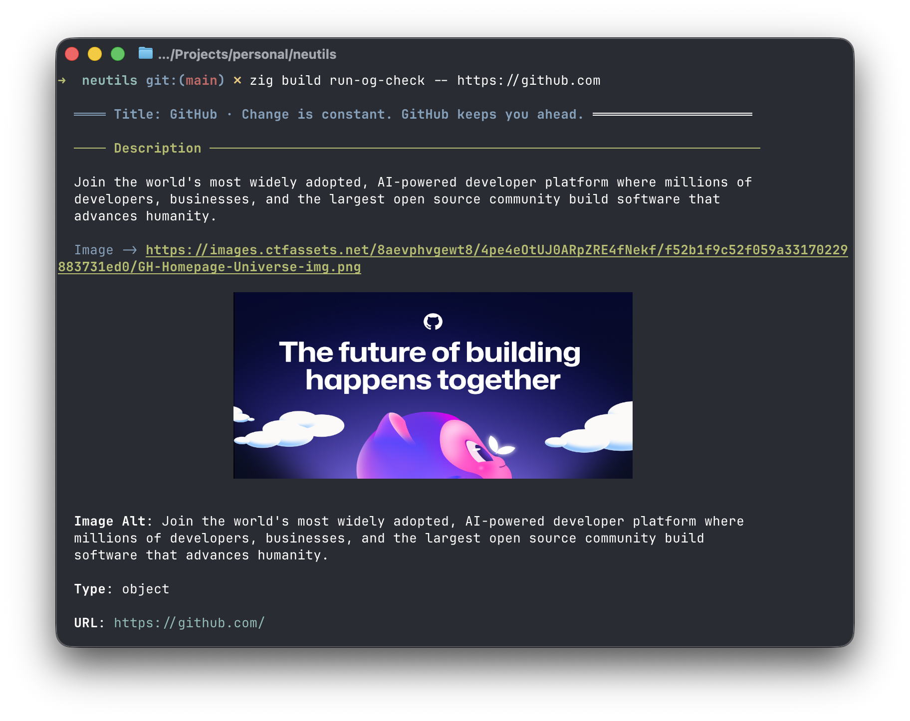

# og-check

Fetch a URL and render its OpenGraph / Twitter Card metadata.



## Usage

```
og-check [OPTIONS] <url>
```

## Arguments

| Argument | Description |
|----------|-------------|
| `url` | URL to fetch and inspect |

## Options

| Option | Short | Description |
|--------|-------|-------------|
| `--output-format` | `-o` | Output format (`opengraph`, `twitter`, `table`, `json`) |

The default format is `opengraph`, which renders a styled preview of the page's OpenGraph metadata. Missing required fields are reported on stderr.

> **Note**: Inline images (`og:image`, `twitter:image`) are only displayed when your terminal supports the [Kitty graphics protocol](https://sw.kovidgoyal.net/kitty/graphics-protocol/). In other terminals, only the image URL is shown.

## Examples

```bash
# Default: rendered OpenGraph preview
og-check https://github.com/deevus/neutils

# Twitter Card preview (falls back to og:* fields when twitter:* are absent)
og-check -o twitter https://github.com/deevus/neutils

# All meta tags as a table, grouped by namespace
og-check -o table https://github.com/deevus/neutils

# Machine-readable output
og-check -o json https://github.com/deevus/neutils
```
